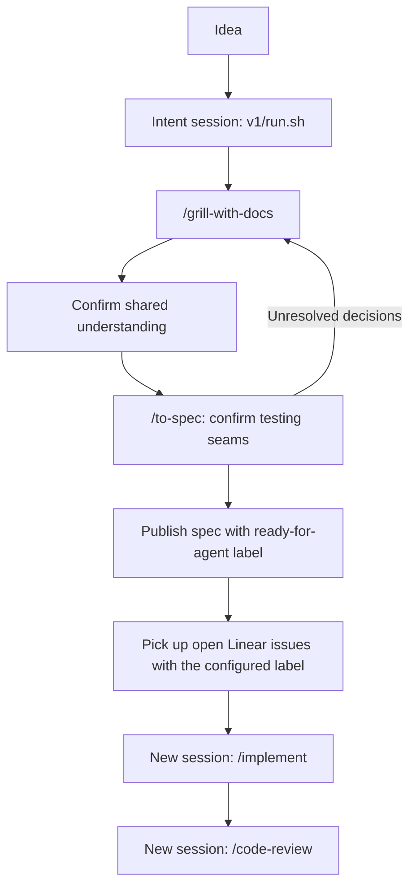

# Factory


```mermaid
flowchart TD
    Idea[Idea] --> Intent["Intent session: v1/run.sh"]
    Intent --> Grill["/grill-with-docs"]
    Grill --> Confirm[Confirm shared understanding]
    Confirm --> Spec["/to-spec: confirm testing seams"]
    Spec --> Ready[Publish spec with ready-for-agent label]
    Spec -->|Unresolved decisions| Grill
    Ready --> Queue[Pick up open Linear issues with the configured label]
    Queue --> Implement["New session: /implement"]
    Implement --> Review["New session: /code-review"]
```

## Run the factory

```bash
LINEAR_API_KEY=lin_api_... ./v1/run.sh /path/to/repo
```

To run only the intent stage:

```bash
./v1/intent.sh /path/to/repo
```
